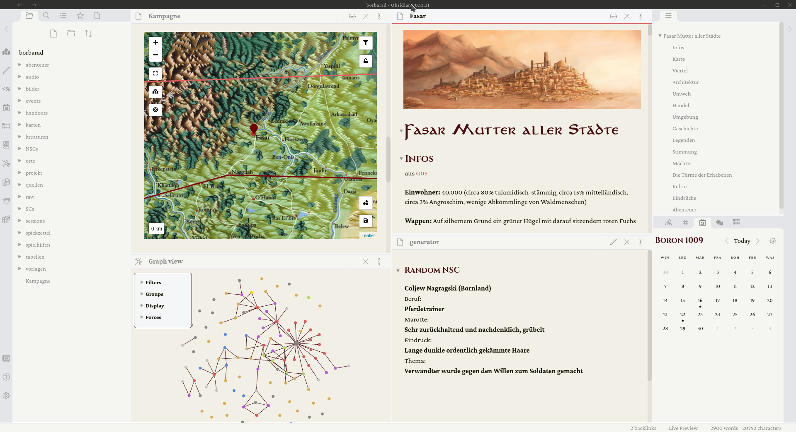

# Ilaris Theme für Obsidian

## Was ist Obsidian
Obsidian ist ein Markdown-Editor mit einigen Features zum Verwalten und Verlinken von einzelnen Notizen. Es ist durch Plugins um viele weitere Features wie zB DiceRoller, Interaktive Karten zu einem komfortablen Kampagnen-Manager für Fantasyspiele erweiterbar. Kleine Häppchen oder lange Texte können wie wir es von Wikis kennen mit einander verknüpfen. Wer Markdown bereits kennt findet sich schnell zurecht und die meisten Funktionen sind Intuitiv durch Drag and Drop oder einfacher Textbefehle verfügbar. Meinem ersten Eindruck nach, das perfekte Tool zum Vorbereiten und Managen von Kampagnen.

## Das Theme
Dies Repository stellt die `ilaris.css` zur verfügung, die im jeweiligen Projektordner in `.obsidian/themes/` abgelegt werden kann. Bisher sind es nur eine Handvoll anpassungen um auf die schnelle, etwas gemütlicheres fantasy feeling aufkommen zu lassen. Wenn ich weitere Dinge anpasse werde ich sie ggf. hier hochladen.

## Vorschau

